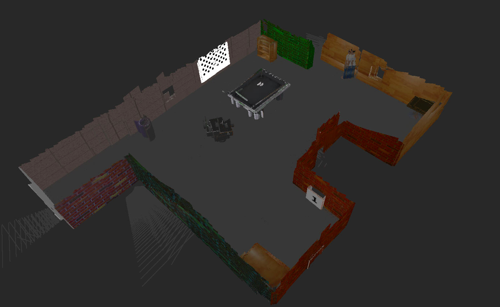

# UD_MAP_MY_WORLD

Udacity Robotics Software Engineer Nanodegree Prject of Visual SLAM using RTAB map ROS package.


# Installation

```sh
mkdir -p ~/catkin_ws/src
cd ~/catkin_ws
catkin_make
source devel/setup.bash
cd ~/catkin_ws/src
git clone rtabmap_ros
git clone https://github.com/gauti1311/UD_MAP_MY_WORLD.git
```

Install RTAB-map packge from source using this [link](https://github.com/introlab/rtabmap_ros#build-from-source)

Install package dependencies

```sh
rosdep install -i rtabmap_ros
rosdep install -i [package_name]
```

# Build 

```sh
cd ~/catkin_ws
catkin_make
```

# Run

```sh
roslaunch my_robot world.launch
roslaunch my_robot teleop.launch
rosrun teleop_twist_keyboard teleop_twist_keyboard.py
```

Run Robot in simualted gazebo environment slowly using teleop package and create an RTAB-map. 

  


A 3D map generated looks like this

  
